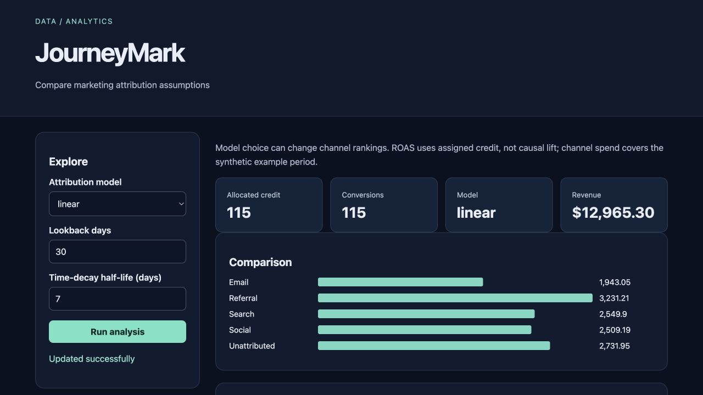

# JourneyMark

Compare marketing attribution assumptions for **growth analysts**.

Original topic: **Marketing Attribution Model Comparison** from [the source post](https://www.instagram.com/p/DdyMaogE4ud/).

> Local portfolio implementation developed with Codex assistance. Measured results and limitations are documented; no production adoption, revenue or hiring outcome is claimed.



## What works

- First/last/linear/time-decay models
- lookback
- conversion reconciliation

[Example output](reports/example-output.json) · [Recorded checks](reports/test-results.txt) · [Learning and interview guide](LEARNING_GUIDE.md)

## Start

Python 3.12 is the validated Python runtime. Run commands from this repository directory. Windows users activate `.venv\Scripts\activate` instead of `source`.

```sh
python3.12 -m venv .venv
source .venv/bin/activate
python -m pip install -r requirements.txt
python generate.py
python app.py
```

Open **http://127.0.0.1:8080**. Keep the process running. Set `PORT` to use another port (Retention Studio uses `--port`). The Python development servers are intended for local demonstrations.

## Demonstration

Compare all four models, shorten the lookback, and inspect the unattributed share. Confirm allocated credits equal conversion count and revenue totals remain unchanged.

## Architecture and decisions

Browser controls → validated Flask API → project analysis/workflow → results and export.

Stack: pandas · Flask.

1. Allocate each conversion using a documented lookback boundary and exclude touches before a prior conversion.
2. Preserve unattributed conversions rather than dropping their revenue.
3. Compare first, last, linear and time-decay models while testing conservation of credit and revenue.

## Verification

```sh
python -m pytest -q
```

See [VERIFICATION.md](VERIFICATION.md) for actual executed checks, setup verification, model/data results and any outstanding environment limitations. A workflow file alone is not evidence that CI passed.

## Data and attribution

Synthetic touchpoint journeys. See [DATA_AND_SOURCES.md](DATA_AND_SOURCES.md) for provenance and usage notes. Original project code is MIT unless a preserved source file or dependency states otherwise. Model and third-party data licenses remain separate.

## Limitations and next improvement

Synthetic paths and spend. Attribution is descriptive allocation, not incrementality or causal ROI. No identity stitching, view-through impressions, cross-device behavior or consent workflow.

Suggested extension: Add a position-based model and reuse the conservation tests.

## Honest portfolio use

This implementation and documentation were developed with substantial Codex assistance. Before presenting it, run the demonstration, explain the design choices, and complete the suggested independent modification. Do not describe generated code as work experience, an accepted upstream contribution, or a deployed production service.
